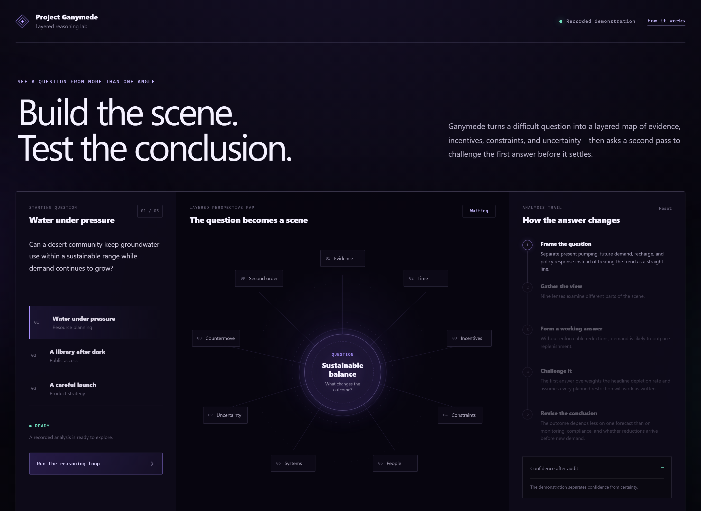
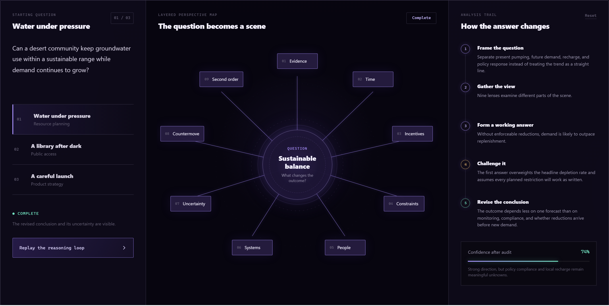
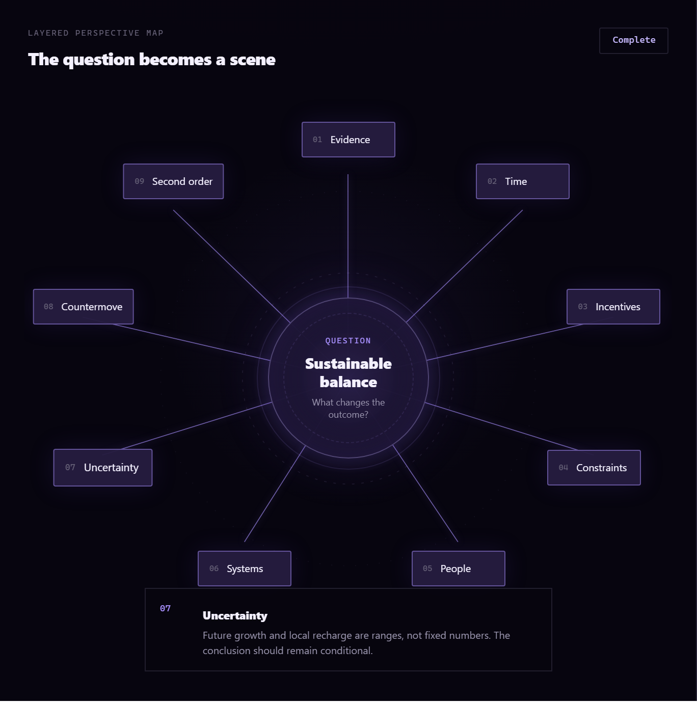

# Project Ganymede

**An interactive demonstration of layered, self-auditing strategic reasoning.**

Most difficult questions do not fail because nobody produced an answer. They fail because the first framing quietly decides which facts count. Project Ganymede turns a question into a scene: nine perspectives examine its evidence, timing, incentives, constraints, people, systems, uncertainty, likely countermoves, and second-order effects. A separate audit then challenges the working answer before the conclusion is revised.



*A difficult question becomes a visible map instead of disappearing into a single prompt and answer.*

## Who this is for

- **A curious builder** exploring how AI-assisted reasoning can expose its structure instead of hiding it.
- **A researcher or student** interested in multi-perspective analysis, uncertainty, and self-critique.
- **A designer** thinking about how complex machine reasoning can become legible to ordinary people.
- **A prospective collaborator or employer** evaluating the product thinking, interface design, and architecture behind the experiment.

## What it actually does

1. Choose one of three recorded demonstrations: water planning, public-library access, or an experimental product launch.
2. Read the question in plain language.
3. Run the reasoning loop and watch nine perspectives light up around the central question.
4. Follow the analysis trail from framing and evidence to a working answer.
5. See a separate audit identify what the first answer treated too confidently.
6. Inspect the revised conclusion and the uncertainty that remains.
7. Select any perspective on the map to read what it contributes.



*The answer remains connected to the framing, evidence, audit, and revision that produced it.*

## Why the audit matters

The first coherent answer is not automatically the best one. It may be built around a familiar pattern, lean too heavily on one dramatic fact, or convert uncertainty into false precision. Ganymede gives the audit its own visible step so disagreement becomes part of the reasoning process rather than an invisible prompt instruction.



*Each perspective can be inspected independently, including the uncertainty the conclusion still carries.*

## The idea behind Ganymede

The original metaphor is a layered tapestry: each lens asks a different question about the same situation. Together, those views form a box, chessboard, or wireframe scene that a reasoning system can examine.

In the larger private research project, evidence-gathering services act as the system's eyes, while a separate auditor behaves more like a conscience. The two can pass a conclusion back and forth until the result better fits the available evidence. This public edition isolates the inspectable interaction and uses recorded demonstrations, so it runs without private accounts, external AI services, or hidden data.

## Try it yourself

This edition is intentionally simple: it is a static web application with no API keys, backend, tracking, or build step.

### What you'll need

- Node.js 20 or newer
- A modern browser

### Steps

```powershell
git clone https://github.com/anitacigawet/Project-Ganymede.git
cd Project-Ganymede
npm start
```

Open `http://127.0.0.1:4173`.

To run the source and data checks:

```powershell
npm run check
```

## What works today

- Three self-contained recorded demonstrations.
- An interactive nine-perspective map.
- A staged reasoning and audit sequence.
- Inspectable layer explanations and calibrated confidence.
- Responsive desktop and mobile layouts.
- Reproducible Playwright screenshot capture.
- No credentials, remote services, or user data.

## What this edition does not claim

Project Ganymede is an interface and research demonstration, not proof that a particular reasoning framework predicts real events. The examples are curated to show how the loop behaves. Their confidence values belong to the demonstrations and should not be treated as measured forecasting accuracy.

The complete research workshop remains private because it contains account-bound integrations, unpublished experiments, and historical operational material that do not belong in a clean public release.

## Repository guide

- `index.html` — the complete accessible interface structure.
- `src/app.js` — interaction and staged-analysis behavior.
- `src/data.js` — the recorded scenarios and their nine perspectives.
- `src/styles.css` — responsive visual system and animation.
- `test/` — integrity checks for the demonstration data.
- `scripts/` — local server and reproducible screenshot capture.
- `docs/screenshots/` — the public images used above.

## Contributing

Noncommercial contributions are welcome. Start with [CONTRIBUTING.md](CONTRIBUTING.md), especially if you want to improve accessibility, clarify an explanation, or add a responsibly sourced demonstration.

## Credits

Created by James as a public, portfolio-ready distillation of the larger Project Ganymede research workshop. Its central metaphors—layered lenses, evidence as the system's eyes, an auditor as conscience, and a wireframe scene for analysis—come from the project's original design notes.

## License

Project Ganymede is source-available under the [PolyForm Noncommercial License 1.0.0](LICENSE). Noncommercial use, study, modification, and redistribution are permitted under its terms. Commercial use is not granted.

