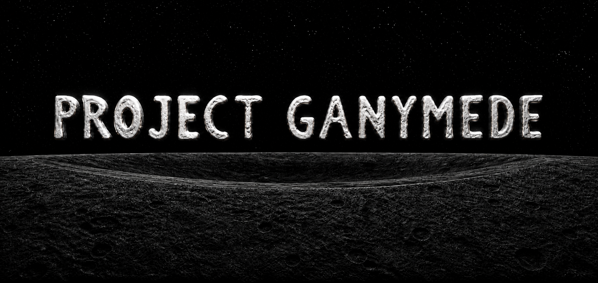
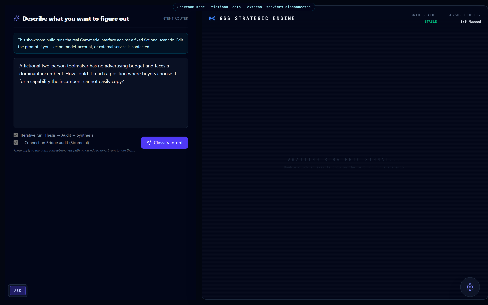
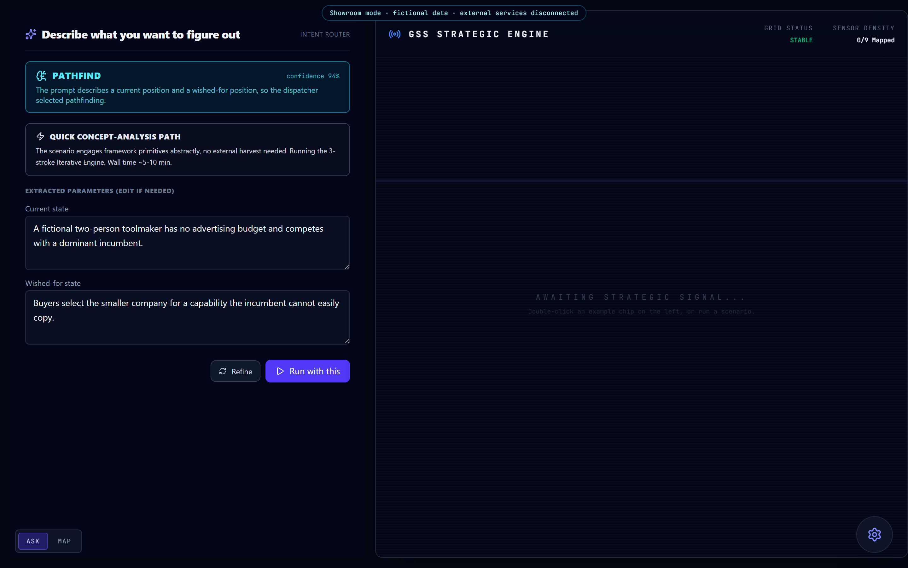
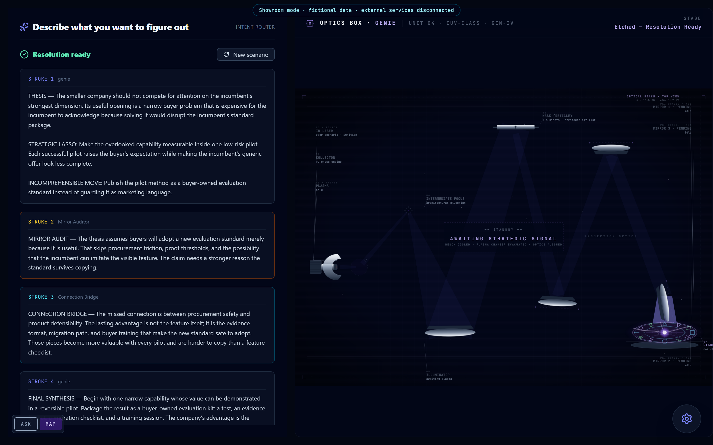

<p align="center">
  
</p>

# Project Ganymede

**A working strategic-physics research interface that routes a scenario, develops a thesis, attacks its weak points, and shows the reasoning process as it changes.**

Project Ganymede is a private analysis sandbox built around the 9D Chess framework. The complete workshop combines a FastAPI orchestration layer, research and audit services, and this Next.js interface. This public repository publishes the real interface in a deterministic showroom mode: the controls, state changes, orchestrator map, gravity-well canvas, and lithography view are the same surfaces used by the working project, while the scenario and outputs are fixed fictional data.



*The actual Ganymede workspace: a plain-language intent router beside the GSS strategic-engine canvas.*

## What Ganymede does

1. You describe a question, forecast, desired outcome, competitive situation, or analysis you want challenged.
2. The intent router selects the appropriate research pathway and extracts the scenario into editable fields.
3. The engine develops an initial strategic thesis.
4. A Mirror Auditor looks for failure modes inside that reasoning.
5. A Connection Bridge looks for relationships the first synthesis missed.
6. A final stroke revises the resolution using both critiques.
7. The interface exposes the run as it happens through an orchestrator map, an optics-box lithography view, and—when a GSS configuration is supplied—a 3D strategic landscape.



*The router selected the pathfinding workflow and exposed the scenario fields before the run began.*

## The interface is part of the research

Ganymede does not treat the result as a single chat response. Its visual language is designed to keep the system's parts legible:

- The **intent router** turns ordinary language into one of four research pathways: Prediction Cleanroom, Genie pathfinding, Offensive Architect, or Mirror Audit.
- The **orchestrator map** shows the engine, research substrate, and audit side as distinct participants rather than collapsing them into one model call.
- The **lithography view** presents each analytical stroke as another pass through the machine, making thesis, audit, bridge, and synthesis visible as separate stages.
- The **gravity-well canvas** renders a supplied GSS model as a nine-dimensional strategic landscape.
- The **Cortex Clipboard** is the explicit handoff point between a written resolution and its 3D configuration.



*The fictional showroom run has completed: the resolution remains beside the optics box that produced it.*

## Try the showroom

The hosted showcase is available at [ganymede.scootsolute.org](https://ganymede.scootsolute.org). It uses a fixed fictional scenario and does not contact a model, external account, or private corpus.

To run the same showroom locally:

```powershell
git clone https://github.com/anitacigawet/Project-Ganymede.git
cd Project-Ganymede
npm install
npm run build
npm start
```

Open `http://127.0.0.1:4173`, then choose **Classify intent** and **Run with this**.

## What is public and what is not

This repository contains the real frontend and its fictional deterministic run. It does not contain the private orchestration backend, account-bound integrations, unpublished run records, live research material, credentials, or operator state.

The showroom is evidence of the interface and workflow, not a claim that the underlying framework has been generally validated or that its fictional output is advice. The private research project has recorded experiments and blind validations, but those results remain bounded to their documented cases.

## Technology

- Next.js 16 and React 19
- React Three Fiber and Three.js for the GSS visualization
- Framer Motion for state transitions
- Tailwind CSS 4
- Playwright for reproducible desktop and mobile captures

## Repository guide

- `src/app/` — the showroom routes and layout.
- `src/components/` — the real router, runner, maps, optics box, canvas, and supporting controls.
- `src/data/demoMode.ts` — the fixed fictional public run.
- `src/types/` — the shared Ganymede interface types.
- `scripts/serve.mjs` — a small local server for the static export.
- `scripts/capture-screenshots.mjs` — reproducible captures of the actual interface.
- `docs/screenshots/` — the images used in this README and the portfolio.

## Credits

Created by James. Project Ganymede draws on the separate [9D Chess](https://github.com/anitacigawet/9D-Chess) theoretical project, but this repository is the public showroom for Ganymede's own interface and workflow.

## License

Project Ganymede is source-available under the [PolyForm Noncommercial License 1.0.0](LICENSE). Noncommercial use, study, modification, and redistribution are permitted under its terms. Commercial use is not granted.
